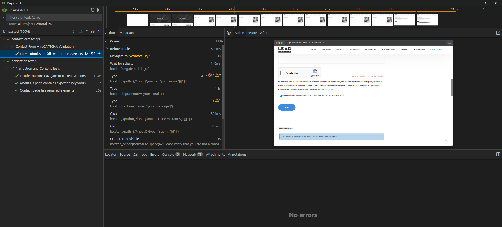
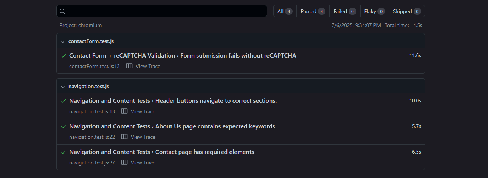

# Lead Consult UI Automated Tests with Playwright

## Project Overview

This project contains automated UI tests using Playwright for the publicly accessible website [https://www.leadconsult.eu](https://www.leadconsult.eu). The tests are designed to simulate real-world conditions by validating navigation, DOM structure, and dynamic form behavior including reCAPTCHA validation.

## Main Objectives

- **Navigation and Content Validation**  
  Verify that the main header buttons (Home, About Us, Services, Contact Us) work correctly and lead to the expected content.  
  Check that the "About Us" section contains keywords like "team" or "consulting".  
  Confirm that the "Contact" section contains at least one of the following: message field, email address, or send button.

- **Contact Form with reCAPTCHA**  
  Automate filling out the contact form with valid name, email, and message.  
  Attempt to submit the form without ticking the "I'm not a robot" checkbox.  
  Validate that an error message appears related to the missing reCAPTCHA confirmation.

## Technical Requirements

- Built with [Playwright](https://playwright.dev/) using the `@playwright/test` framework.  
- Source code is maintained in a Git repository (GitHub/GitLab).  

## How to Run Tests

1. After cloning the repository, install the dependencies:  
    - npm install

2. To run tests in headless mode (without browser UI):
    - npx playwright test

Example Terminal Output:


3. To run tests in UI mode (with Playwright Test Runner UI):
    - npx playwright test --ui


4. To view the test reports after the run:
    - npx playwright show-report


## NOTES
### Browser Configuration
In the playwright.config.js file, tests are configured to run only on Firefox and Chrome browsers. The reason is that i don't have Safari (WebKit engine) on my Machine,
therefore if you don't have Webkit configured as well, when you run the command "npx playwright test" and the execution befins on Firefox, Chrome and Webkit - all tests
will fail for Webkit.

### How to Break Tests Intentionally to Verify Assertions:
To verify that assertion failures are properly reported, you can intentionally break some tests:
1. In navigation.test.js, the following assertions are used:
    - await assertions.aboutUsAssert.shouldContainKeywords();
    - await assertions.contactUsAssert.shouldBeOnContactPage();

To break these tests, modify the keyword arrays used in the assertions for shouldContainKeywords OR change expected values in shouldBeOnContactPage:

Steps for shouldContainKeywords:

1. Open the file assertionsAboutUs.js (for shouldContainKeywords method).
2. The original method looks like this:

```js
async shouldContainKeywords(keywords = ['team', 'consulting']) {
  await this.subtitle.waitFor({ state: 'visible' });
  const content = await this.subtitle.textContent();
  if (!content) return false;
  const lower = content.toLowerCase();
  return keywords.some(k => lower.includes(k));
}
```
3. To break the test, change the keywords to invalid ones, for example:
```js
async shouldContainKeywords(keywords = ['teamS', 'consulting1']) {
  await this.subtitle.waitFor({ state: 'visible' });
  const content = await this.subtitle.textContent();
  if (!content) return false;
  const lower = content.toLowerCase();
  return keywords.some(k => lower.includes(k));
}
```
4. This will cause the assertion to fail because the expected keywords will not be found on the page.

Steps for shouldBeOnContactPage:

1. Open the file assertionsContactUs.js (for shouldBeOnContactPage method).
2. The original method looks like this:

```js
async shouldBeOnContactPage() {
    await expect(this.page).toHaveURL(/.*\/contact-us\/?/);
    await expect(this.contactUstitle).toBeVisible();
    await expect(this.contactUstitle).toHaveText(/contact us/i);
}
```
3. To break the test, change the values to invalid ones, for example:
```js
async shouldBeOnContactPage() {
    await expect(this.page).toHaveURL(/.*\/contact-us12\/?/);
    await expect(this.contactUstitle).toBeVisible();
    await expect(this.contactUstitle).toHaveText(/contact usS/i);
}
```
4. This will cause the assertion to fail because the expected values will not be found on the page.